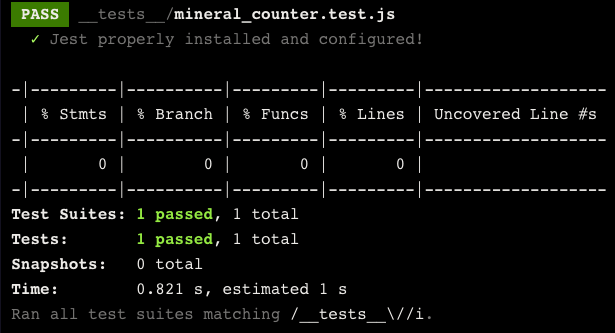
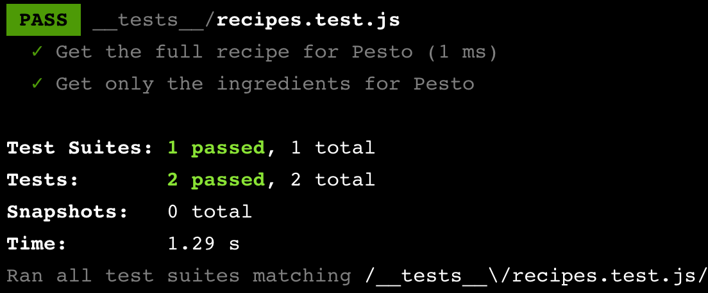

# Learning Jest

In this challenge you will complete a series of basic Math and String functions and then test them!

Have a look inside `mathFunctions.js` and `stringFunctions.js` and complete the commented out functions. 

Once you have finished, move on to testing them below. Read the instructions very carefully. Take your time and take breaks. You must complete the entire readme before moving on to the `TDD-bowling challenge`

***Note*** remember to export your functions. Because we are just using pure javascript with no React we have a slightly different import method we will need to use ```modules.exports = { fnName, fnName }``` and in the test file ```const { fnName, fnName } require("./fileName")```

### Installing Jest

Before we can start testing our code with Jest, we need to install and configure the Jest package. For **_offline students_** we will supply you with prepackaged repos. For **_online students_** we can download Jest using the Node Package Manager (NPM) by running the following command in the terminal:

```
npm install jest --save-dev
```

The `npm install jest` command installs the Jest package, if you want you can add `@^27` after the word `jest` which specifies the version of Jest to be installed. If no version is specified, the latest version will be installed by default. The `--save-dev` flag specifies that Jest should be saved as a developer dependency. After installing, we should see "jest" included in the `devDependencies` section of the `package.json` file:

```json
"devDependencies": {
  "jest": "<version number>"
}
```

Note: If you were installing Jest globally on your machine, you would need to include the `-g` flag to access the command line tools.

Now that Jest is installed, let's create a file to write our tests. Jest looks for files inside a `__tests__/` directory or any file ending in `.test.js` or `.spec.js`.

It's a good practice to give your test file the same name as the file you want to test. For example, if you're testing a file named `math.js,` you can make a directory called `__tests__` and put a test file inside called `math.test.js`. This helps keep things organized and clear.

Once you have your test files created (we'll cover writing test logic in upcoming exercises), Jest provides a terminal command to run individual test files:

```
npx jest <filepath/filename>
```

For example, to run the `math.test.js` test file, you would write:

```
npx jest __tests__/math.test.js
```

You can run individual files by specifying the filename after the `jest` command.

We can also run tests on all files with `.test.js` or `.spec.js` extensions or files within a `__tests__/` folder by simply running the `jest` command:

Running the `npx jest` command with no additional arguments will test all files in the `__tests__/` directory.

## Instructions

- [ ] Installing Jest (skip if offline)

- [ ] Create A Test File

1. Look at the file you want to tests name and create a test file with an appropriate name (the same one).

- [ ] Create a fake passing test

We'll learn about writing tests later in this lesson, but for now, let's use a provided example test to see what happens when we run it. Copy this into your new test file.

```javascript
test("Example Test", () => {
  const name = "bob";
  expect(name).toBe("bob");
});
```

### Configuring Jest

Before we start writing our tests, let's cover some important practices in Jest.

By default, Jest displays test output in the terminal when `npx jest` is run. However, we can customise this output using command line flags. One commonly used flag is `--coverage`.

- [ ] To view a coverage report showing which lines of code were tested, run the following command:

```
npx jest --coverage
```

The coverage report is displayed in the terminal and saved in a `coverage/` directory. It helps us ensure that our code is thoroughly tested. The report includes four categories:

- Statement coverage: analyses the percentage of executed statements in our code.
- Branch coverage: analyses the percentage of executed edge cases in our code.
- Function coverage: analyses the percentage of called functions during testing.
- Line coverage: analyses the percentage of executed lines in our source code.

Currently, each category shows 0% coverage since we haven't written any tests yet. As we continue writing tests, we'll see the coverage report change.

Typing the full command every time we want to run tests can be tedious. To simplify this, we can preconfigure the test command in our `package.json` file.

- [ ] Add the following to the `"scripts"` property in `package.json`:

```json
{
  "scripts": {
    "test": "jest --coverage"
  }
}
```

- [ ] Now, we can run our tests with a simple terminal command:

```
npm test
```

This command executes the tests and generates the coverage report. Run it and see our passing test and our coverage report!



## Introduction to Unit Testing with Jest

Now that we have Jest installed and set up, it's time to create our first unit test. Unit tests are used to verify the behavior of small units of code, like individual functions.

In this example, let's focus on testing functions from an imaginary module called `recipes.js`. Let's imagine this module contains two functions we want to test:

1. `findRecipe()`: This function takes a recipe name and array and searches an array to retrieve the specified recipe, which includes the recipe's ingredients and quantities as an object.

2. `getIngredients()`: This function converts an object obtained through `findRecipe()` into an array containing only the ingredients.

Here's an example usage of these functions:

```javascript
import { findRecipe, getIngredients } from "./recipes.js";

findRecipe("pesto", (recipe) => {
  console.log(recipe, recipies);
  // Outputs the recipe object with ingredient quantities

  console.log(getIngredients(recipe));
  // Outputs an array of ingredients
});
```

When writing unit tests, it's important to test each function independently. In Jest, we accomplish this by using the `test()` function to create separate containers for our testing logic.

The `test()` function takes three arguments:

1. A description of what is being tested.
2. A callback function that contains the assertions and testing logic.
3. An optional timeout (in milliseconds) to specify the maximum duration of the test. If not provided, the default timeout is 5000 ms.

For our `recipes` module, we can create separate test containers for each function like this:

```javascript
import { findRecipe, getIngredients } from "./recipes.js";

test("Retrieve the complete recipe for Pesto", () => {
  // Testing logic for findRecipe() goes here...
});

test("Retrieve only the ingredients list for Pesto", () => {
  // Testing logic for getIngredients() goes here...
});
```

In the above example, we have two tests:

1. The first test aims to retrieve the complete recipe for Pesto. Inside the callback function, we write our testing logic (we'll cover this in more detail later).

2. By not specifying the third argument, we use the default timeout of 5000 ms.

When we run `npm test`, each `test()` function call generates a separate entry in the test output. In this example, the output might look like this:



Now it's your turn to give it a try!

## Writing the test!

- [ ] First, call the test() function. For now, you can call the function without any arguments.

- [ ] Next, we’ll add a description. In the test() function call you just made, describe the test by passing in a string as the first argument

- [ ] Next, we’ll need a place to put our testing logic. Pass an empty (for now) arrow function as the second argument to test().

In the next exercise we will fill in this callback function. For the third and final parameter, let’s force Jest to use the default timeout (aka add nothing more).

- [ ] Now run the npm test command in your terminal. At this point, you should see a successful test output. Since the test contains no errors or failed assertions, it passes!

## Unit Testing with Jest (Part 2)

Now that we have set up our `test()` container, it's time to complete our first unit test by writing assertions using the `expect()` function provided by Jest.

The `expect()` function is used to assert how we expect our program to run and is used in conjunction with matcher methods, such as `.toBe()`, as shown in the example below:

```javascript
expect(2 + 2).toBe(4);
```

In this example, the expression `2 + 2` is passed to `expect()`, and the `.toBe(4)` matcher method determines the expected value and validates the expression.

Let's revisit the `getIngredients()` method in the `recipes` module to understand how assertions fit into a test.

Recall that `getIngredients()` converts an object containing recipe ingredients and quantities into an array of just the ingredients. To test this function, we can add testing logic to the callback passed to the `test()` function:

```javascript
//file: __tests__/recipes.test.js

// import the function to test
import { getIngredients } from "./recipes.js";

test("Get only the ingredients list for Pesto", () => {
  // Arrange
  const pestoRecipe = {
    Basil: "2 cups",
    "Pine Nuts": "2 tablespoons",
    Garlic: "2 cloves",
    "Olive Oil": "0.5 cups",
    "Grated Parmesan": "0.5 cups",
  };
  const expectedIngredients = [
    "Basil",
    "Pine Nuts",
    "Garlic",
    "Olive Oil",
    "Grated Parmesan",
  ];

  // Act
  const actualIngredients = getIngredients(pestoRecipe);

  // Assert
  expect(actualIngredients).toEqual(expectedIngredients);
});
```

In this example, we follow the Arrange, Act, Assert pattern within the callback passed to `test()`:

1. Arrange: We declare the input (`pestoRecipe`) and the expected output (`expectedIngredients`) for the function being tested (`getIngredients()`).
2. Act: We pass the input to the function being tested and store the result in `actualIngredients`.
3. Assert: We use the `expect()` function and the `.toEqual()` matcher to compare the expected output with the actual output.

Multiple `expect()` assertions can be made within a single `test()` call. All assertions must pass for the entire test to pass.

Now it's your turn to practice writing assertions for your tests!

Note: The `.toBe()` matcher is used for comparing simple data types for equality, while the `.toEqual()` matcher performs deep equality comparisons.

- [ ] Take a look at the your test.js file. In the test() function you created, write in the callback function three comments

```javascript
// ARRANGE
// ACT
// ASSERT
```

- [ ] ARRANGE: Think about the description, what is it that you need to pull out to test your function. Does the function have inputs? Set up the variables (fake data) needed for your test.

in our ongoing example it would look like this

```javascript
//arrange
const pestoRecipe = {
  Basil: "2 cups",
  "Pine Nuts": "2 tablespoons",
  Garlic: "2 cloves",
  "Olive Oil": "0.5 cups",
  "Grated Parmesan": "0.5 cups",
};

const expectedIngredients = [
  "Basil",
  "Pine Nuts",
  "Garlic",
  "Olive Oil",
  "Grated Parmesan",
];
```

***note*** For now, any input paramaters should be layed out in seperate variables even if they are simple like a number or word. For example a function that adds to numbers together should still have const num1 and const num2 in the arrange of its test. As tests get more complicated we wont do this, but it makes it way more readable in the AAA pattern with simple tests. 

- [ ] ACT: This is where you call your function and assign the return value to a variable.

```javascript
//act
const actualIngredients = getIngredients(pestoRecipe);
```

- [ ] ASSERT: Write your expect with the appropriate matcher , you can just use toEqual to begin with. If you want to stretch yourself look some up on Jest documentation and try a new one out! We will go into these more below. 

```javascript
//assertions
expect(actualIngredients).toEqual(expectedIngredients);
```
## Exploring More Matcher Methods

Congratulations on writing your first unit test! In the previous exercise, you used the `expect()` assertion function along with the `.toEqual()` matcher method. Now, let's learn about a few more common matcher methods that can be helpful in your testing journey.

In the following code snippet, we have added several new assertions to test the `getIngredients()` method from the `recipes` module:

```javascript
//file: __tests__/recipes.test.js
 
// import the function to test
import { getIngredients } from "./recipes.js"; 
 
test("Get only the ingredients list for Pesto", () => {
  // Arrange
  const pestoRecipe = {
    'Basil': '2 cups',
    'Pine Nuts': '2 tablespoons',
    'Garlic': '2 cloves',
    'Olive Oil': '0.5 cups',
    'Grated Parmesan': '0.5 cups'
  };
  const expectedIngredients = ["Basil", "Pine Nuts", "Garlic", "Olive Oil", "Grated Parmesan"];
 
  // Act
  const actualIngredients = getIngredients(pestoRecipe);
 
  // Assertions
  expect(actualIngredients).toBeDefined();
  expect(actualIngredients).toEqual(expectedIngredients);
  expect(actualIngredients.length).toBe(5);
  expect(actualIngredients[0] === "Basil").toBeTruthy();
  expect(actualIngredients).not.toContain("Ice Cream");
});
```

Let's review the matcher methods used in this example:

- `.toBeDefined()` is used to verify that a variable is not `undefined`. It is often the first check performed in a test.
- `.toEqual()` is used for deep equality checks between objects.
- `.toBe()` is similar to `.toEqual()`, but it is specifically used to compare primitive values.
- `.toBeTruthy()` is used to verify whether a value is truthy or not.
- `.not` is used before another matcher to verify the opposite result.
- `.toContain()` is used to check if an item exists in an array. In this case, the `.not` matcher is used to verify that "Ice Cream" is **not** present in the array.

As mentioned in the previous section, there are many different matcher methods available in Jest. Instead of trying to memorise them all, it is recommended to consult the complete list in the Jest documentation whenever you need to use a specific matcher.


## Final Challenge

- [ ] Set up a test for each function in your maths and strings files, remember to make two seperate test files, This will take you sometime. Try using atleast 4 more matchers in your tests.
      
- [ ] Make sure to keep checking your coverage!

- [ ] Bonus points for anyone who reaches 100% in lines and functionality. 
